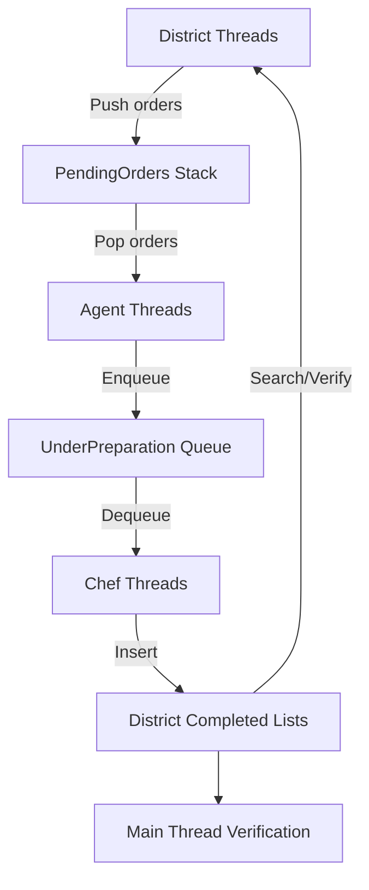

# Distributed Food Delivery Simulation System

## Overview
A pthread-based distributed system simulating food order processing, implementing concurrent data structures for order handling across customer districts, order agents, and chefs.

## Key Components

### Thread Types
| Thread Type          | Quantity          | Description |
|----------------------|-------------------|-------------|
| Customer District    | N_THREADS / 2     | Generates food orders |
| Order Agent          | N_THREADS / 4     | Records orders |
| Chef                 | N_THREADS / 4     | Prepares orders |
| Main Thread          | 1                 | Coordinates verification |

### Shared Data Structures
1. **Pending Orders Stack**
   - Lock-Free Elimination BackOff Stack
   - Stores generated orders before processing

2. **Under Preparation Orders Queue**
   - Unbounded Total Queue
   - Holds orders being prepared

3. **Districts Array** (size = N_THREADS/2)
   - Each entry contains:
     - Completed Orders List (Lazy Synchronization Linked List)
     - Checksum integer

## Execution Flow



## Order Processing Details

### Order Generation

- Each **district thread** (`tid`) generates `DIST` orders.
- **Order IDs:**  
  `order_id = (tid * DIST) + idx` where `idx ∈ [0, DIST - 1]`
- **Example:**  
  For `tid = 0`: order IDs range from `0` to `DIST - 1`
- All generated orders are **pushed** to the `PendingOrders` **stack**.

### Order Recording

- Each **agent thread**:
  - **Pops** `2 * DIST` orders from the `PendingOrders` stack.
  - **Enqueues** them to the `UnderPreparation` **queue**.

### Order Preparation

- Each **chef thread**:
  - **Dequeues** `2 * DIST` orders from the `UnderPreparation` queue.
  - Inserts each order into the **appropriate district's Completed List**:
    - **Target district:** `order_id / DIST`

### Order Verification

- **District threads:**
  - Continuously **scan their Completed List**
  - **Sum** the found order IDs into a **checksum**

- **Main thread verifies:**
  - `PendingOrders` stack is **empty**
  - `UnderPreparation` queue is **empty**
  - For each district:
    - Completed list contains **exactly `DIST` orders**
    - The **sum** of order IDs matches the **expected value**
    - **Checksum** from the thread matches the **list sum**


- Configure thread number in Makefile
- Build using these commands

```
make
./main
make clean
```
